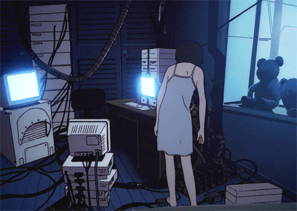

 

"Be yourself everyone else is already taken."

 

more about me

 

---

# The Boy Savior.

`Full Stack Developer` &nbsp;

 

Hi, I'm Sam and I make cool websites and stuff 3:

 

### Languages

### Frontend

### Backend & Cloud

### Tools

---

<table>
<tr>
<td align="center" width="220">

**15+**
 
Projects

</td>
<td align="center" width="220">

**4 yrs**
 
Experience

</td>
<td align="center" width="220">

**Web**
 
Primary focus

</td>
</tr>
</table>

---

### Latest projects

<table width="100%">
<tr>
<td width="50%" valign="top">

**[JustVent](https://justvent.net)**
 
A platform helping people with mental health challenges vent and express their feelings freely
  

</td>
<td width="50%" valign="top">

**[Portfolio](https://03x.dev/)**
 
Not really a portfolio its more of a profile where i keep my latest work
  

</td>
</tr>
</table>

---

### Currently building

<table width="100%">
<tr>
<td width="50%" valign="top">

**Saqr Store** &nbsp;
 
A digital store for one of my clients
  

</td>
<td width="50%" valign="top">

**Side Wave** &nbsp;
 
A Spicetify extension that fully redesigns Spotify's sidebar
  

</td>
</tr>
</table>

---

U can find me here &nbsp;·&nbsp; <a href="https://03x.dev">03x.dev</a>

